<div align="center">

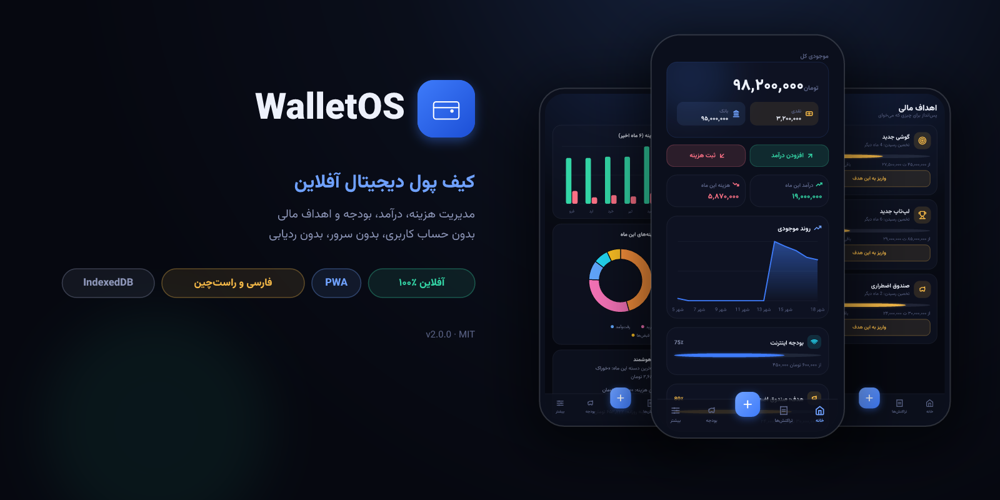

[](package.json)
[](LICENSE)
[](manifest.json)

[](package.json)


</div>

<div dir="rtl">

# کیف پول دیجیتال WalletOS

**مدیریت هزینه، درآمد، بودجه و اهداف مالی — کاملاً آفلاین، بدون حساب کاربری، بدون سرور، بدون ردیابی.**

WalletOS یک وب‌اپ فارسی و راست‌چین است که همهٔ داده‌هایت را فقط روی خود دستگاهت
(داخل IndexedDB مرورگر) نگه می‌دارد. بدون بیلد، بدون دپندنسی، تک‌فایل — روی هر
هاست استاتیکی اجرا می‌شود و با یک کلیک مثل یک اپ واقعی روی گوشی نصب می‌شود.

</div>

---

<div dir="rtl">

## ✨ ویژگی‌ها

| | قابلیت | خلاصه |
| --- | --- | --- |
| 💰 | **موجودی نقدی و بانکی** | دو کیف پول جدا که با هر تراکنش خودکار به‌روز می‌شوند |
| 🧾 | **تراکنش‌ها** | درآمد/هزینه با دسته‌بندی، برچسب، یادداشت، تاریخ شمسی و **مانده لحظه‌ای** هر تراکنش |
| 🔍 | **جستجو و فیلتر** | جستجو در مبلغ و توضیحات + فیلتر بازه (امروز/هفته/ماه/سال)، نوع، کیف پول و دسته |
| 📊 | **بودجه ماهانه** | سقف هزینه برای هر دسته با نوار پیشرفت و هشدار نزدیک‌شدن به سقف |
| 🎯 | **اهداف پس‌انداز** | تعریف هدف، واریز مرحله‌ای، درصد پیشرفت و **تخمین زمان رسیدن** |
| 📈 | **گزارش‌ها** | نمودار ۶ ماهه درآمد/هزینه، دونات تفکیک هزینه، **۶ بینش هوشمند** و ۵ هزینه برتر ماه |
| 🏷️ | **دسته‌بندی دلخواه** | ۱۱ دسته آماده + ساخت دسته با ۲۲ آیکون و ۱۲ رنگ؛ برچسب‌های دلخواه برای تراکنش‌ها |
| 📦 | **بکاپ و بازیابی** | خروجی و ورودی JSON از همهٔ اطلاعات + ریست کامل |
| 📴 | **آفلاین واقعی** | PWA با Service Worker؛ بدون اینترنت هم کامل کار می‌کند |
| 🌙 | **فارسی و راست‌چین** | رابط کاملاً فارسی با فونت وزیرمتن، اعداد فارسی و تاریخ شمسی |
| 🛡️ | **ضدخرابی** | درخواست حافظه ماندگار، صفحه ریکاوری هنگام خطا و ابزار ریست اضطراری |

</div>

---

<div dir="rtl">

## 📸 گالری

| | |
| --- | --- |
| 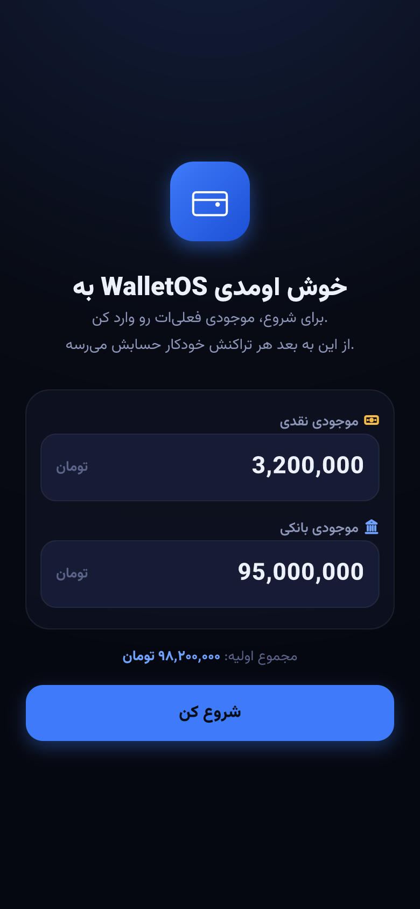<br/>**شروع در چند ثانیه** — فقط موجودی اولیه را وارد کن | 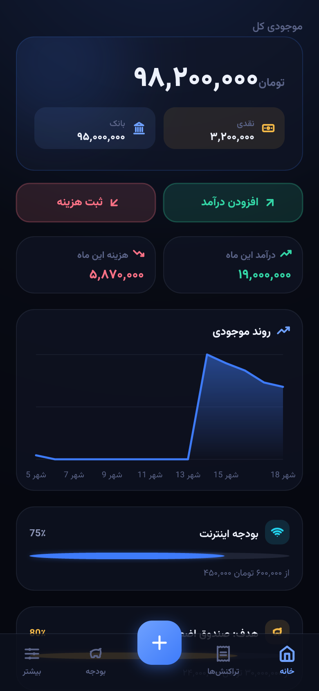<br/>**خانه** — موجودی کل، روند ۱۴ روزه و تراکنش‌های اخیر |
| 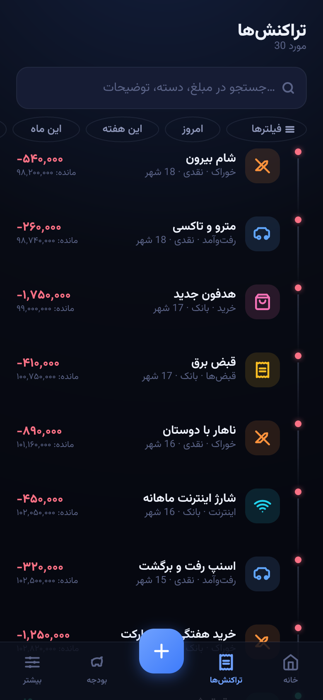<br/>**تراکنش‌ها** — جستجو، فیلتر و مانده لحظه‌ای هر سطر | 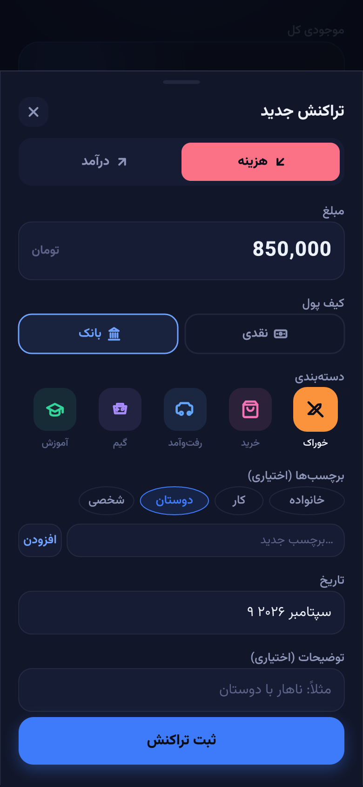<br/>**ثبت تراکنش** — نوع، مبلغ، کیف پول، دسته، برچسب و تاریخ |
| 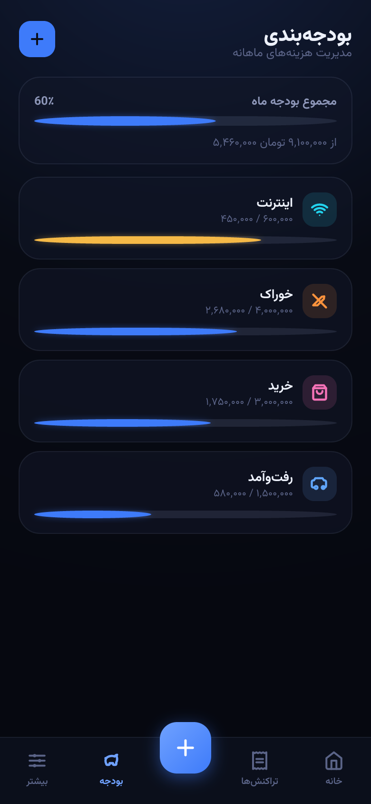<br/>**بودجه‌بندی** — سقف ماهانه هر دسته با نوار پیشرفت | 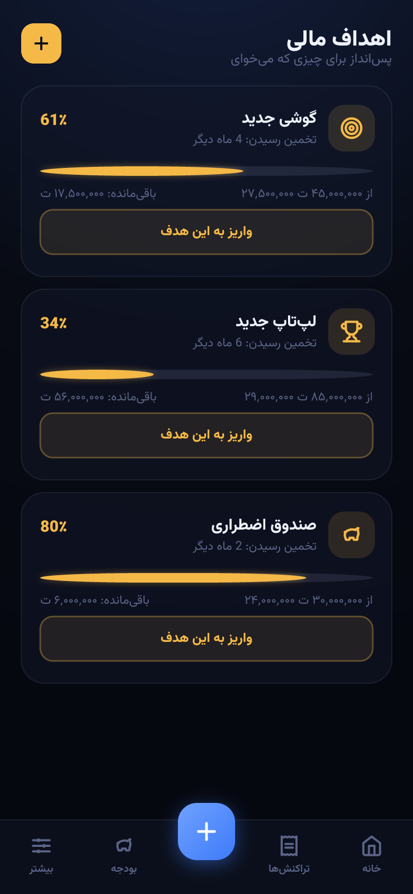<br/>**اهداف مالی** — درصد پیشرفت، باقی‌مانده و تخمین رسیدن |
| 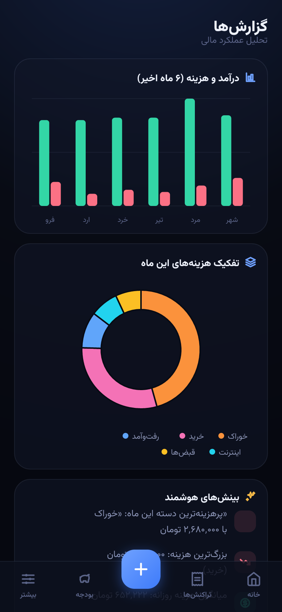<br/>**گزارش‌ها** — نمودار ۶ ماهه، تفکیک هزینه و بینش هوشمند | 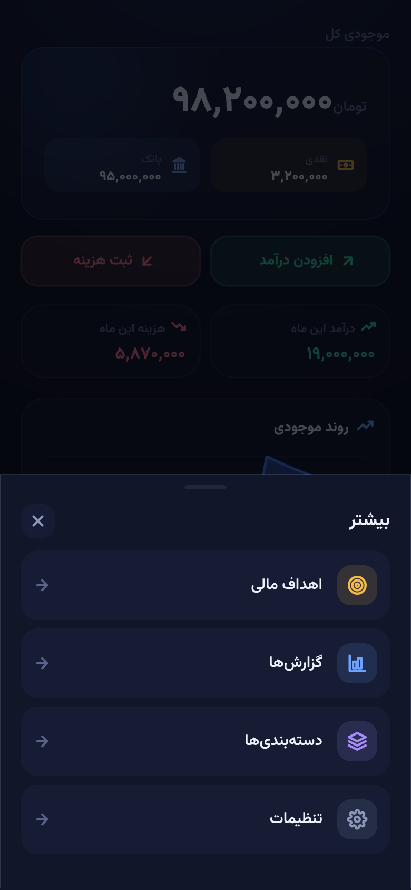<br/>**بیشتر** — میان‌بر اهداف، گزارش‌ها، دسته‌ها و تنظیمات |
| 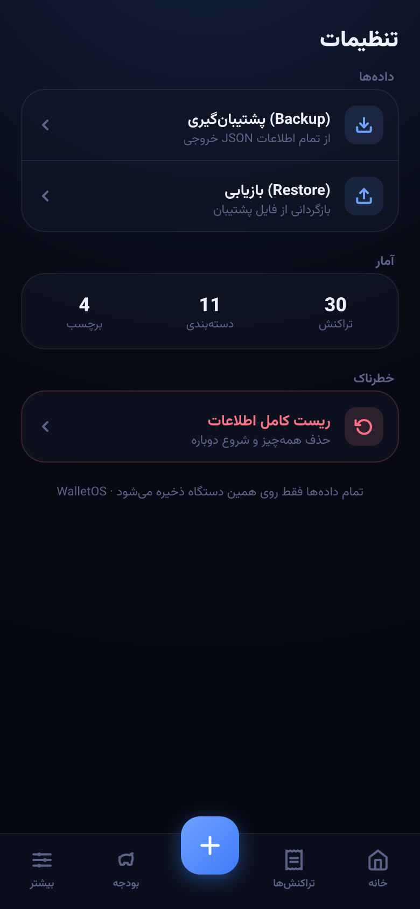<br/>**تنظیمات** — بکاپ JSON، آمار و شروع دوباره | 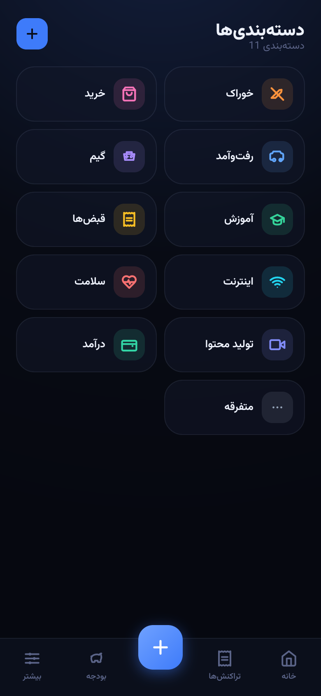<br/>**دسته‌بندی‌ها** — ۱۱ دسته آماده + ساخت دسته دلخواه |

> تصاویر گالری با `scripts/mockups` (قطعی و بازتولیدپذیر، از روی توکن‌های واقعی
> رابط کاربری) ساخته شده‌اند — [راهنما](scripts/mockups/README.md). برای کپچر
> زنده از مرورگر واقعی: `npm run screenshots` (بخش مشارکت).

</div>

---

<div dir="rtl">

## 🚀 شروع سریع

بدون هیچ نصب و بیلدی — فقط یک سرور استاتیک:

</div>

<div dir="ltr">

```bash
npm run dev              # http://localhost:4173  (Node 18+‎، بدون دپندنسی)
PORT=8080 npm run dev    # پورت دلخواه
```

</div>

<div dir="rtl">

یا با هر ابزار دیگری:

</div>

<div dir="ltr">

```bash
python3 -m http.server 8080
```

</div>

<div dir="rtl">

> در محیط واقعی از `https://` (یا `localhost`) استفاده کن؛ Service Worker روی
> HTTP ساده ثبت نمی‌شود و قابلیت آفلاین به «فقط آنلاین» تنزل پیدا می‌کند.

### 📲 نصب به‌عنوان اپ (PWA)

| دستگاه | روش |
| --- | --- |
| اندروید (Chrome) | منوی ⋮ ← افزودن به صفحه اصلی / Install |
| آیفون (Safari) | دکمه Share ← Add to Home Screen |
| دسکتاپ (Chrome/Edge) | آیکون نصب در نوار آدرس |

</div>

---

<div dir="rtl">

## 🧭 تور سریع

1. **شروع** — موجودی نقدی و بانکی فعلی‌ات را وارد کن.
2. **ثبت** — با دکمه ➕ وسط، هزینه یا درآمد ثبت کن (دسته، برچسب، کیف پول، تاریخ).
3. **بودجه** — برای دسته‌های پرخرج (مثل خوراک) سقف ماهانه بگذار.
4. **هدف** — یک هدف پس‌انداز بساز و هر ماه بهش واریز کن.
5. **تحلیل** — آخر ماه سری به گزارش‌ها بزن؛ بینش‌های هوشمند همه‌چیز را خلاصه می‌کنند.
6. **بکاپ** — هر از گاهی از تنظیمات خروجی JSON بگیر و نگه دار.

</div>

---

<div dir="rtl">

## 🏗️ معماری فنی

| لایه | پیاده‌سازی |
| --- | --- |
| رابط کاربری | React باندل‌شده داخل تک‌فایل `index.html` — بدون بیلد، بدون دپندنسی |
| ذخیره‌سازی | IndexedDB دیتابیس `walletos-db` با ۶ استور |
| آفلاین | Service Worker (`sw.js`) + صفحه fallback (`offline.html`) + مانیفست PWA |
| فونت و آیکون | وزیرمتن (Vazirmatn) + Lucide |
| سرور توسعه | `scripts/serve.mjs` — حدود ۱۲۰ خط، فقط Node خالص |

### مدل داده

| استور | نمونه رکورد |
| --- | --- |
| `meta` | `{id:"balances", cash, bank}` |
| `transactions` | `{id, type, amount, wallet, categoryId, tags[], description, date, createdAt}` |
| `categories` | `{id, name, icon, color}` |
| `tags` | `{id, name}` |
| `budgets` | `{id, categoryId, amount}` |
| `goals` | `{id, name, target, icon, contributions[], createdAt}` |

### استراتژی Service Worker

| درخواست | استراتژی | چرا |
| --- | --- | --- |
| ناوبری‌ها | network-first با تایم‌اوت ۲٫۵ ثانیه ← کش ← `offline.html` | نسخه جدید همیشه به کاربر برگشتی می‌رسد |
| اسست‌های هم‌دامنه | stale-while-revalidate | لود فوری + ترمیم بی‌صدا |
| فونت گوگل | cache-first با سقف حجم | عدم دانلود مجدد فونت |
| کراس‌دامنه | passthrough | چیزی که مال ما نیست دست نمی‌خورد |

**انتشار نسخه جدید:** کافی است `VERSION` داخل `sw.js` را بالا ببری؛ کش‌های قدیمی
در `activate` پاک می‌شوند و کاربرِ آنلاین، اعلان درون‌برنامه‌ای
«نسخهٔ جدید آماده است» می‌بیند.

### ساختار پروژه

</div>

<div dir="ltr">

```
index.html                 App shell + React bundle (the program)
sw.js                      Service worker: offline caching & updates
offline.html               Offline fallback page
manifest.json              PWA manifest (+ icons)
scripts/serve.mjs          Zero-dependency static dev server
scripts/screenshots.mjs    Playwright pipeline: real browser captures
scripts/mockups/           Deterministic vector gallery generator
docs/screenshots/          Gallery images + hero banner
docs/github-pages-workflow.yml   Ready-to-copy Pages deploy workflow
```

</div>

---

<div dir="rtl">

## 🔒 حریم خصوصی و پشتیبان‌گیری

- **همه‌چیز محلی:** هیچ بک‌اندی وجود ندارد؛ هیچ بایتی از دستگاهت خارج نمی‌شود.
- **بکاپ:** تنظیمات ← پشتیبان‌گیری، فایل `walletos-backup-YYYY-MM-DD.json` می‌سازد.
  مرتب بکاپ بگیر — پاک‌شدن دیتای مرورگر یعنی حذف همیشگی اطلاعات.
- **ماندگاری:** اپ هنگام اجرا از مرورگر «حافظه ماندگار» می‌خواهد تا IndexedDB زیر
  فشار حافظه پاک نشود (`window.WOS.persistent` وضعیت را نشان می‌دهد).
- **بازیابی:** اگر رندر fail شود، کارت ریکاوری با گزینه‌های *تلاش مجدد* و
  *پاک‌سازی داده* ظاهر می‌شود؛ از کنسول هم:

</div>

<div dir="ltr">

```js
await window.WOS.reset()   // clears caches, IndexedDB, SW — then reloads
```

</div>

---

<div dir="rtl">

## 🌐 استقرار

- **GitHub Pages** — فایل `docs/github-pages-workflow.yml` را به مسیر
  `.github/workflows/pages.yml` کپی کن، کامیت کن و ورک‌فلو را اجرا کن
  (بار اول: Settings ← Pages ← Source روی *GitHub Actions*).
- **هر هاست استاتیک** (Netlify ،Cloudflare Pages ،Vercel و...) — روت ریپو را
  همان‌طور که هست آپلود کن؛ بدون build command و بدون output directory.

همه‌چیز مسیر نسبی است (`./index.html` ،`./sw.js`) پس ساب‌پث پروژه مثل
`https://user.github.io/wallet-OS/` بدون هیچ تنظیمی کار می‌کند.

## 🗺️ نقشه راه

- [ ] استخراج باندل به ماژول‌های `src/` با باندرلر واقعی (قابلیت ریویو و تست)
- [ ] تست واحد برای هلپرهای مالی/تاریخ (تبدیل شمسی، مانده، ریاضی بودجه)
- [ ] دیپلوی خودکار Pages روی `main`
- [ ] خروجی CSV کنار بکاپ JSON
- [ ] یادآور عبور از سقف بودجه (Web Notifications)

## 🤝 مشارکت

1. فورک کن، یک برنچ بساز، تغییر بده و PR بفرست.
2. بدون دپندنسی نگهش دار — این یک اصل معماری است، نه کمبود!
3. تست دستی: `npm run dev` و چک کردن آفلاین (DevTools ← Network ← Offline).

**تصاویر گالری:**

</div>

<div dir="ltr">

```bash
# کپچر واقعی از مرورگر (نیازمند: npm i -D playwright)
npm run dev            # terminal 1
npm run screenshots    # terminal 2 → docs/screenshots/

# یا بازتولید موکاپ‌های وکتوری (قطعی، بدون مرورگر)
npm i --no-save @resvg/resvg-js vazirmatn
python3 scripts/mockups/extract_assets.py
python3 scripts/mockups/main.py && python3 scripts/mockups/hero.py
node scripts/mockups/render.js && cp scripts/mockups/out/*.png docs/screenshots/
```

</div>

<div dir="rtl">

## 📄 لایسنس

[MIT](LICENSE) — ساخته‌شده با ☕ برای مدیریت پول، بدون اینکه پولت را به کسی نشان بدهی.

</div>

---

<details>
<summary><b>🇬🇧 English</b></summary>

<div dir="ltr">

# WalletOS — Offline-first Persian digital wallet

Manage **expenses, income, budgets and savings goals** — fully offline, no
account, no server, no tracking. All data stays in your browser's IndexedDB.

## Features

- 💰 **Cash + bank wallets**, auto-synced with every transaction
- 🧾 **Transactions**: income/expense, categories, tags, notes, running balance, Jalali dates
- 🔍 **Search & filters**: amount/description search + date-range, type, wallet, category filters
- 📊 **Monthly budgets** per category with progress bars and cap warnings
- 🎯 **Savings goals** with contributions, progress % and ETA estimate
- 📈 **Reports**: 6-month income/expense chart, expense donut, 6 smart insights, top-5 expenses
- 🏷️ **Custom categories & tags**: 11 built-ins + your own (22 icons, 12 colors)
- 📦 **JSON backup / restore** + full reset
- 📴 **Real offline PWA** with service worker — zero dependencies, zero build
- 🌙 **Persian RTL UI** with Vazirmatn, Persian digits and Jalali calendar

## Quick start

```bash
npm run dev          # http://localhost:4173 (Node 18+, zero deps)
```

Or any static server: `python3 -m http.server 8080`. Use `https://` (or
`localhost`) in production so the service worker registers.

## Architecture

Single-file React app (`index.html`, no build) + IndexedDB (`walletos-db`:
`meta`, `transactions`, `categories`, `tags`, `budgets`, `goals`) + service
worker (network-first navigations, SWR assets, cache-first fonts) + PWA
manifest. See the Persian sections above for the data model, SW strategy and
deployment (GitHub Pages workflow example included).

## License

[MIT](LICENSE)

</div>

</details>
